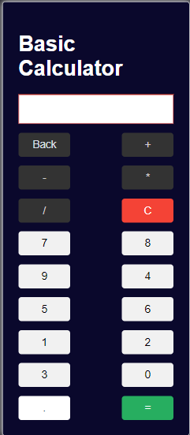

# Calculator App - Brainnest

This repository contains a project we completed as a team during our education at Brainnest. Brainnest is a company that specializes in providing education to aspiring front-end developers, helping students improve their skillset and industry knowledge. A key aspect of the program is fostering the ability to learn and work effectively as a team, ensuring a well-rounded learning experience.

## Project Overview

This is a calculator app with functionality achieved using JavaScript. We built it as a team at Brainnest, demonstrating our ability to collaborate and work together effectively.

## Technologies used

- HTML
- CSS [style/Presentation]
- Javascript [Logic/Working of calculator]

## Live Demo

Check out our Project [here](https://ydaher97.github.io/Calculator-app/)

## Features

- Basic calculator functionality
- Responsive design for various screen sizes
- Collaborative work by the development team

### Sample

## Dev Team

- Vladislav Konstantinov
- Yazeed Daher
- Emre Turan
- Mubarak Bosa
- Basak Sayar

## Getting Started

To get a local copy of the project up and running, follow these simple steps:

1. Clone the repository:

git clone: https://github.com/ydaher97/Calculator-app.git

2. Open the `index.html` file in your browser.

## Acknowledgments

We have worked together to ensure the calculator app is functional, responsive, and visually appealing. Through this project, we have gained valuable experience in collaborating as a team and working towards a common goal. We would like to express our gratitude to the Brainnest team for providing a great educational experience and helping us enhance our front-end development skills. This project would not have been possible without their guidance and support.
